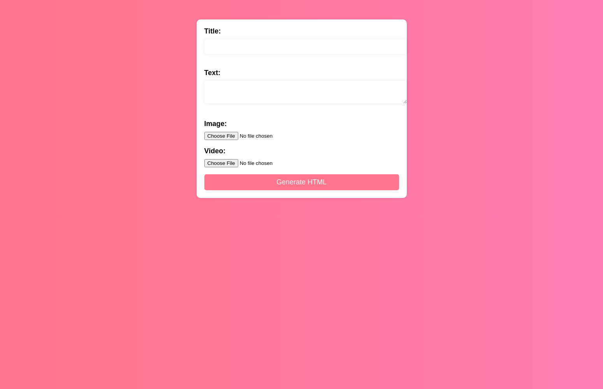

# CMS (HTML Generator)

**[Try it live!](https://raimonvibe.github.io/CMS/)**



A simple, client-side HTML Generator that allows you to create basic HTML pages with text, images, and videos. The application uses the FileReader API to embed media files directly in the generated HTML, making it easy to create self-contained web pages.

## Features
- User-friendly form interface
- Title and text content support
- Image embedding with automatic Base64 conversion
- Video embedding with controls
- Generates downloadable, self-contained HTML files
- No server or external dependencies required
- Responsive design with modern styling

## Getting Started

1. Clone this repository:
   ```bash
   git clone https://github.com/raimonvibe/CMS
   ```
2. Open `index.html` in your web browser
3. Start creating HTML pages!

## Usage Guide

1. Fill out the form fields:
   - **Title**: Enter the heading for your HTML page
   - **Text**: Add your main content (supports plain text)
   - **Image**: Upload an image file to be embedded in the page
   - **Video**: Upload a video file to be embedded with playback controls

2. Click the "Generate HTML" button to create and download your page
3. The generated HTML file will include:
   - Your title and text content
   - Embedded media files (no external hosting needed)
   - Basic responsive styling
   - Video player controls

## Browser Compatibility
This application uses modern JavaScript features including:
- FileReader API
- Blob API
- Download API
Works best in recent versions of Chrome, Firefox, Safari, and Edge.

## Contributing
Contributions are welcome! Here's how you can help:

1. Fork the repository
2. Create a feature branch
3. Make your changes
4. Submit a pull request

Please feel free to open issues for bugs or feature requests.

## License
This project is open source and available under the MIT License.
